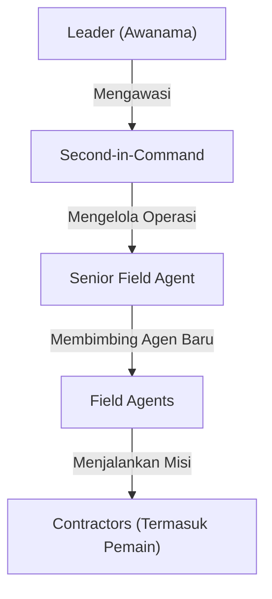

# **Bureau of Time and Plane**
## **Deskripsi Organisasi**

Bureau of Time and Plane (sering disebut sebagai "The Bureau") adalah organisasi rahasia yang didirikan setelah _Time of Troubles_. Diciptakan atas perintah langsung Ao, sang Overgod, The Bureau bertugas untuk mengawasi dan menjaga keseimbangan antara waktu dan dimensi.

Keberadaan The Bureau hampir tidak diketahui oleh kebanyakan makhluk fana. Hanya segelintir entitas, sarjana, dan individu berpengaruh di multiverse yang menyadari peran mereka. Organisasi ini tidak mencampuri urusan duniawi kecuali dalam keadaan yang benar-benar mendesak. Ketika mereka bergerak, dunia berubah selamanya.

---
## **Struktur Organisasi**

Di dalam The Bureau, setiap anggota memiliki peran yang sangat spesifik. Struktur hierarkinya adalah sebagai berikut:

- **[[Awanama - Leader of Bureau]]:**
    - Pemimpin utama The Bureau. Siapapun yang menduduki posisi ini harus meninggalkan identitas lamanya dan hanya dikenal sebagai "Awanama" hingga mereka pensiun.
    - Bertanggung jawab langsung kepada Ao dan memutuskan intervensi besar yang akan dilakukan oleh The Bureau.

- **[[02 - NPCs & Factions/Bureau of Time and Plane/Pustakawan - Second-in-Command|Second-in-Command]]:**
    - Wakil pemimpin yang bertanggung jawab atas administrasi dan pengelolaan informasi di _The Grand Library_.
    - Mengawasi koordinasi antara agen lapangan dan divisi lainnya.

- **Senior Field Agent:**
    - Veteran lapangan yang memiliki pengalaman luas dalam operasi lintas dunia.
    - Perannya mirip dengan _Agent K_ dari _Men in Black_—seorang mentor bagi agen yang lebih muda.

- **Field Agents:**
    - Agen yang bertugas menjalankan misi di berbagai realitas.
    - Mereka bertindak sebagai pengamat, eksekutor, atau diplomat tergantung pada kebutuhan misi.

- **Contractors:**
    - Individu yang direkrut oleh The Bureau untuk menangani tugas-tugas tertentu.
    - Pemain akan berperan sebagai salah satu _contractor_ dengan kode khusus: **Contractor #777**.

---
## **Markas Besar: The Grand Library**

The Bureau beroperasi dari sebuah pusat pengetahuan yang luar biasa besar, dikenal sebagai _The [[Grand Library]]_.

- Struktur ini tidak hanya berisi buku dan arsip, tetapi juga berbagai fasilitas untuk eksperimen magis, pengamatan planar, dan tempat tinggal bagi para anggota The Bureau.

- Dalam banyak hal, The Grand Library menyerupai markas _Men in Black_, dengan agen yang selalu bergerak, menggunakan portal, dan mengenakan seragam berpalet warna tertentu seperti yang diperlihatkan dalam gambaran yang tersedia.

- Dari tempat ini, semua operasi The Bureau diawasi dan dikendalikan.

---
## **Tujuan dan Motif**

The Bureau tidak memiliki ambisi untuk menguasai atau mengubah dunia. Mereka hanya bertindak ketika ancaman terhadap aliran waktu dan keberlanjutan realitas mulai terlihat. Namun, pergerakan mereka jarang diketahui, dan banyak yang menganggap mereka sebagai legenda atau sekadar teori konspirasi yang diciptakan oleh para sarjana gila.

Tugas utama mereka saat ini adalah mengumpulkan **artefak-artefak planar** yang memiliki dampak besar terhadap keseimbangan multiverse. Tetapi alasan pastinya… masih menjadi misteri.

> "Kita bukan hakim, kita bukan penguasa. Kita hanya memastikan bahwa waktu dan ruang tetap berjalan sebagaimana mestinya." — _Awanama, pemimpin The Bureau_